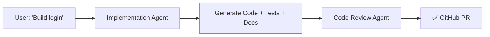

# 🤖 Awesome Prompts

> **Enterprise-Grade AI Agents + Reusable Skills for Autonomous Code Generation**

<div align="center">

[](https://github.com/sharmapuneet1510/awesome-prompts)
[](https://github.com/sharmapuneet1510/awesome-prompts/releases)
[](LICENSE)
[](https://github.com/sharmapuneet1510/awesome-prompts/commits/main)
[](docs/)

**Compatible with:** Claude Code • GitHub Copilot • Cursor • Windsurf • VS Code • Gemini CLI • Continue.dev • OpenAI • Aider

</div>

---

## 🚀 Quick Overview

**Awesome Prompts v2.0** is a comprehensive, **production-ready system** of **13 role-based AI agents** and **22 reusable skills** that transform requirements into enterprise-grade code with:

| Feature | Details |
|---------|---------|
| 🎯 **54+ Callable Functions** | `agent:function` syntax for targeted workflows (see [AGENTS_FUNCTIONS.md](AGENTS_FUNCTIONS.md)) |
| 🧪 **100% Test Coverage** | Unit, integration, and E2E tests with business validation |
| 📚 **Auto-Documentation** | JSDoc, docstrings, Javadoc + architecture guides + HTML sites |
| 🎯 **JIRA Integration** | Parse JIRA JSON/CSV → interactive HTML backlog reports |
| 🏗️ **Multi-Tech Support** | Java • Python • React • TypeScript • Node.js • SQL |
| 🤝 **MCP Servers** | JIRA, VCS, GitHub integrations via MCP |
| 🧠 **Auto-Context** | Generate architecture.md, tech-stack.md, context.json |
| ⚙️ **Full Orchestration** | Build complete systems (DB + API + UI + tests) + refactor monoliths |

---

## 💡 New in v2.0: Function Dispatch Interface

Use `agent:function` syntax to call specific agent workflows without full scope selection:

```bash
# Documentation agent
documentation:context path=./my-project          # Build context.json + architecture.md
documentation:code path=./src                    # Generate code docs only
documentation:api path=./backend                 # Generate OpenAPI spec only

# Architecture agent
architecture:design requirements="..." scale="..." # Design new system
architecture:refactor path=./monolith             # Refactor brownfield system

# Business analyst
ba:report file=jira-export.json                  # Parse JIRA → HTML backlog
ba:parse file=jira-export.csv                    # Parse JIRA → JSON

# And 48+ more functions across all agents...
security:audit path=./src
test:generate files=src/**
autonomous:build file=requirements.txt
```

**See [AGENTS_FUNCTIONS.md](AGENTS_FUNCTIONS.md) for complete reference of all 54 functions.**

---

## 📂 Repository Structure

```
awesome-prompts/
│
├── 📋 instructions/                    ← Universal rules & intake forms
│   ├── master_instruction_set.md      ← Non-negotiable rules for all agents
│   ├── java_project_intake.md         ← Java/Spring Boot Q&A (33 questions)
│   └── python_project_intake.md       ← Python Q&A with OOP patterns
│
├── 💡 prompts/                         ← Categorized prompt templates
│   ├── code-review/                   ← Code review agent prompts
│   ├── testing/                       ← Test generation templates
│   ├── codebase-analysis/             ← Code mapping & tracing
│   ├── email/                         ← Email writing & review
│   ├── project-management/            ← User stories, workflow mapping
│   ├── incident-management/           ← Production issue investigation
│   └── reporting/                     ← HTML report generation
│
├── 🤖 agents/                          ← 13 role-based agents (v2.0 consolidated)
│   ├── autonomous/autonomous_dev_agent.md ← Full-stack orchestrator
│   ├── implementation_agent.md        ← Feature builder (build, test, doc)
│   ├── documentation_agent.md         ← Code docs + architecture + API specs [MERGED]
│   ├── architecture_agent.md          ← System design + refactoring [MERGED]
│   ├── business_analyst_agent.md      ← JIRA → HTML backlog reports [NEW]
│   ├── code_review_agent.md           ← PR validation + quality scoring
│   ├── test_case_generator_agent.md   ← 100% coverage tests + JIRA validation
│   ├── security_auditor_agent.md      ← Vulnerability scanning + threat modeling
│   ├── codebase_auditor_agent.md      ← Tech debt + violation scanning
│   ├── performance_optimizer_agent.md ← Bottleneck analysis + optimization
│   ├── production_debugger_agent.md   ← Root cause analysis + edge cases
│   ├── integration_agent.md           ← CI/CD + Docker + IaC + monitoring
│   ├── technical_lead_agent.md        ← Architecture reviews + tech decisions
│   ├── senior_frontend_engineer_agent.md ← Component design + a11y + testing
│   └── README.md                      ← Agent guide with function dispatch syntax
│
├── 🛠️ skills/                          ← 22 reusable implementation modules (v2.0)
│   ├── code_documentation_skill.md    ← JSDoc/docstrings/Javadoc (100% coverage)
│   ├── database_skill.md              ← SQL schema + migrations + indexing
│   ├── backend_skill.md               ← REST API generation wrapper
│   ├── frontend_skill.md              ← React component generation wrapper
│   ├── test_skill.md                  ← Test suite generation orchestrator
│   ├── code_review_skill.md           ← 6-phase code review + scoring
│   ├── context_builder_skill.md       ← Architecture analysis + context.json
│   ├── java_advanced_skill.md         ← Java 17/21 + Spring Boot patterns
│   ├── python_advanced_skill.md       ← Python 3.11+ + async patterns
│   ├── react_advanced_skill.md        ← React 18+ + TypeScript + a11y
│   ├── security_auditor_skill.md      ← OWASP audit + threat modeling
│   ├── jira_html_report_skill.md      ← Parse JIRA → HTML backlog [NEW v2.0]
│   └── [10 more skills...]            ← Code health, error handling, messaging, etc.
│
├── 🔧 tools/                           ← Utility scripts & generators
│   ├── exporter.py                    ← Export to 9 platforms
│   ├── code_review_generator.py       ← Generate HTML reports [NEW]
│   ├── code_review_reporter.py        ← Format MR comments [NEW]
│   ├── context_builder.py             ← Generate architecture docs
│   └── [4 more tools...]
│
├── 📊 docs/
│   ├── superpowers/
│   │   ├── specs/                     ← Design specifications
│   │   │   └── 2026-05-25-code-review-agent-v3-design.md [NEW]
│   │   └── plans/                     ← Implementation plans
│   │       └── 2026-05-25-code-review-agent-v3.md [NEW]
│   └── context/                       ← Generated project documentation
│
└── 📚 README.md (you are here!)
```

---

## 🎬 Getting Started

### Installation

```bash
# Clone the repository
git clone https://github.com/sharmapuneet1510/awesome-prompts.git
cd awesome-prompts

# No dependencies required!
# (Agents run via Claude Code, Copilot, or compatible platforms)
```

### Quick Start (5 Minutes)

<details open>
<summary><b>✨ Example 1: Build a User Registration Feature</b></summary>

**Step 1: Copy the Implementation Agent**
```
File: agents/implementation_agent.md
```

**Step 2: Provide Your Requirement**
```
"Build user registration with email validation and password hashing"
```

**Step 3: Agent Delivers**
- ✅ Code (src/auth/register.py)
- ✅ Tests (tests/test_register.py) — 100% coverage
- ✅ Docs (JSDoc/docstrings with examples)
- ✅ GitHub PR (ready for review)

**Expected Output:**
```python
# Generated: src/auth/register.py
def register_user(email: str, password: str) -> User:
    """
    Register a new user with email and password.
    
    Args:
        email: User email address (RFC 5322 format)
        password: Plain-text password (will be hashed with bcrypt)
    
    Returns:
        User object with id, email, created_at
    
    Raises:
        ValueError: If email format is invalid
        EmailAlreadyExists: If email is already registered
    
    Example:
        user = register_user("john@example.com", "secure_password")
        assert user.email == "john@example.com"
    """
    # Auto-implemented with full docstring
```

</details>

<details>
<summary><b>📊 Example 2: Generate Test Cases with JIRA Validation</b></summary>

**Input:** JIRA ticket AUTH-456 (User Login)

**Process:**
1. Fetch requirement from JIRA
2. Extract acceptance criteria
3. Generate unit + integration tests
4. Validate all criteria are tested
5. Run full test suite (100% coverage)

**Output:**
```bash
$ pytest tests/test_login.py -v

tests/test_login.py::test_login_with_valid_credentials PASSED
tests/test_login.py::test_login_with_invalid_email PASSED
tests/test_login.py::test_login_with_weak_password PASSED
tests/test_login.py::test_login_with_concurrent_attempts PASSED
tests/test_login.py::test_login_with_rate_limiting PASSED
...
================== 8 passed, 100% coverage ==================
```

**JIRA Validation:**
```
✅ AC1: User can log in with email/password
✅ AC2: Invalid credentials return 401
✅ AC3: Rate limiting after 5 failed attempts
✅ AC4: Password attempt limit enforced
```

</details>

<details>
<summary><b>🔍 Example 3: Code Review with Requirement Validation</b></summary>

**Input:** PR #456 (merge request) + JIRA ticket PROJ-123

**Review Process:**
1. ✅ **Requirement Validation** — Does PR implement all JIRA acceptance criteria?
2. ✅ **Code Quality** — Design patterns, SOLID principles, security
3. ✅ **Test Coverage** — Adequate tests? Error cases? Edge cases?
4. ✅ **Documentation** — APIs documented? Comments clear?
5. ✅ **Scoring** — Weighted grade (A-F)

**Generated Report:**

```
╔════════════════════════════════════╗
║     CODE REVIEW SCORECARD          ║
╠════════════════════════════════════╣
║ Requirement Met:   95% ████████░  ║
║ Code Quality:      85% ███████░░  ║
║ Test Coverage:     72% ██████░░░  ║
║ Documentation:     68% ██████░░░░ ║
╠════════════════════════════════════╣
║ Final Grade: B (83.5/100)          ║
║ Status: ⚠️ Changes Needed           ║
╚════════════════════════════════════╝

Critical Issues:
1. [Security] P0 — SQL injection in email lookup
2. [Testing] P1 — Missing error case tests

→ Full analysis: /reviews/review-PROJ-123.html
```

</details>

---

## 🤖 Core Agents (v4.2.0)

### **1. Implementation Agent** — Full-Lifecycle Feature Builder
| Aspect | Details |
|--------|---------|
| **Input** | Requirement (free text / JIRA / file) |
| **Process** | Parse → Detect tech → Plan → Generate code + tests + docs |
| **Output** | Source code + 100% test coverage + JSDoc/docstrings + GitHub PR |
| **Time** | ~5-10 minutes per feature |
| **Tech Stack** | Java, Python, React, TypeScript, Node.js, SQL |

**Use When:** Building new features, adding API endpoints, implementing business logic

### **2. Code Review Agent v3** — Requirement-Driven Validation [NEW]
| Aspect | Details |
|--------|---------|
| **Input** | PR/MR + JIRA requirement |
| **Process** | 6-phase analysis (requirement → code quality → testing → docs → scoring) |
| **Output** | Interactive HTML report + MR comment summary |
| **Scoring** | A-F grades with weighted metrics |
| **Features** | Requirements validation, SOLID enforcement, security review, performance analysis |

**Use When:** Reviewing PRs against requirements, ensuring code quality, validating acceptance criteria

**New v3.0 Capabilities:**
- Requirement Validation: Does PR implement all JIRA acceptance criteria?
- Weighted Scorecard: Requirement (40%) + Code Quality (30%) + Testing (20%) + Docs (10%)
- Interactive Reports: HTML with charts, heatmaps, and actionable suggestions
- MR Comments: Posts summaries directly to GitHub/GitLab

### **3. Test Case Generator** — 100% Coverage + Business Validation
| Aspect | Details |
|--------|---------|
| **Input** | Code + JIRA ticket |
| **Process** | Analyze code → Generate tests → Validate all ACs → Run & measure |
| **Output** | Unit + integration tests with 100% coverage + JIRA validation |
| **Standard** | Comprehensive test methods, AAA pattern (Arrange-Act-Assert) |

**Use When:** Need complete test coverage, validating business requirements in tests, generating E2E tests

### **4. Writer Agent** — Auto-Generate Documentation
| Aspect | Details |
|--------|---------|
| **Input** | Source code files |
| **Process** | Parse → Extract APIs → Generate JSDoc/docstrings/Javadoc |
| **Output** | 100% documented APIs with examples + README updates + changelog |
| **Format** | Language-specific (JSDoc, docstrings, Javadoc) |

**Use When:** Need API documentation, README generation, changelog creation, documentation maintenance

### **5. Autonomous Dev Agent** — Full-Stack Orchestrator
| Aspect | Details |
|--------|---------|
| **Input** | Project requirement (e.g., "Build e-commerce checkout") |
| **Process** | 14-step orchestration (plan → DB → API → UI → tests → docs → PR) |
| **Output** | Complete working system (DB + backend + frontend + tests) |
| **Scope** | End-to-end project generation |

**Use When:** Starting new projects, generating complete systems, building MVPs quickly

---

## 🛠️ Reusable Skills

Each skill is **tech-agnostic** and used by agents to implement features:

| Skill | Purpose | Languages | Agents Using |
|-------|---------|-----------|--------------|
| **code_documentation** | JSDoc/docstrings/Javadoc | JS/TS/Python/Java | All |
| **database** | Schema + migrations + queries | PostgreSQL/MySQL/MongoDB | Autonomous Dev |
| **backend** | REST API generation | FastAPI/Spring Boot/Node | Implementation |
| **frontend** | React component generation | React/TypeScript | Implementation |
| **test** | Unit/integration/E2E tests | JUnit5/pytest/Jest | Test Generator |
| **code_review** [NEW] | 6-phase review analysis | Language-agnostic | Code Review Agent |
| **apache_camel** | Integration framework patterns | Apache Camel | Advanced users |

Skills are **importable** for custom workflows:

```python
# Example: Use code_documentation_skill in your own agent
from skills.code_documentation_skill import DocumentationGenerator

generator = DocumentationGenerator()
docs = generator.generate_from_code("src/auth.py", format="docstring")
```

---

## 📋 Workflow Examples

### Workflow 1: Feature Implementation (5 Steps)



**Step-by-Step:**
1. **Requirement Input** — "Add JWT-based authentication"
2. **Tech Detection** — Scans project, detects Python/FastAPI
3. **Code Generation** — Generates auth routes, models, middleware
4. **Test Generation** — 100% coverage tests (happy path + errors)
5. **Documentation** — JSDoc/docstrings with examples
6. **GitHub PR** — Creates PR with auto-written description
7. **Code Review** — Validates implementation against requirement

**Time:** ~8 minutes

---

### Workflow 2: Test Generation with JIRA Validation


**Example JIRA Ticket:**
```
KEY: AUTH-456
Title: User Login with Rate Limiting

Acceptance Criteria:
1. User can log in with email/password
2. Invalid credentials return 401 Unauthorized
3. After 5 failed attempts, account locks for 15 minutes
4. Concurrent login attempts are prevented
```

**Generated Tests:**
```bash
test_login_valid_credentials() ✓
test_login_invalid_email() ✓
test_login_invalid_password() ✓
test_login_rate_limiting() ✓
test_login_concurrent_attempts() ✓
test_login_account_lockout() ✓
test_login_recovery_after_lockout() ✓
test_login_concurrent_recovery_attempts() ✓
```

**Coverage Report:**
```
Coverage: 100% (23 / 23 statements)
JIRA Validation: ✅ All 4 ACs covered
```

---

### Workflow 3: Code Review with Requirement Validation


**Example Review:**

| Phase | Score | Status |
|-------|-------|--------|
| Requirement Met | 87% | ⚠️ AC4 (async email) partially implemented |
| Code Quality | 83% | ⚠️ One SRP violation in UserService |
| Test Coverage | 70% | ❌ Missing error case tests |
| Documentation | 65% | ❌ Missing docstrings (40% of methods) |
| **Final Grade** | **B (80.2)** | **⚠️ Changes Needed** |

**Critical Issues Found:**
1. [Security] P0 — SQL injection in email validation
2. [Testing] P1 — Missing error case coverage
3. [Documentation] P2 — 40% of methods undocumented

---

## 🔗 Integration Points

### MCP Servers (Model Context Protocol)

Awesome Prompts integrates with these MCP servers for external data:

| Server | Purpose | Used By | Example |
|--------|---------|---------|---------|
| **JIRA MCP** | Fetch requirements & acceptance criteria | Test Generator, Code Review | `mcp.fetch_jira("PROJ-123")` |
| **GitHub MCP** | Create PRs, post comments, manage issues | All agents | `mcp.create_pr(title, body)` |
| **GitLab MCP** | GitLab integration | All agents | `mcp.create_mr(...)` |
| **Bitbucket MCP** | Bitbucket integration | All agents | `mcp.create_pr(...)` |

### Platform Support

```
┌─────────────────────────────────────────────────┐
│         Compatible Platforms                    │
├──────────────────┬──────────────────────────────┤
│ IDE Integration  │ Claude Code, Copilot, Cursor │
│ Code Editors    │ VS Code, JetBrains, Windsurf│
│ CLI Tools       │ Copilot CLI, Gemini CLI     │
│ LLM Providers   │ Anthropic (Claude)          │
│ VCS             │ GitHub, GitLab, Bitbucket   │
│ Project Mgmt    │ JIRA, Linear, Asana         │
└──────────────────┴──────────────────────────────┘
```

---

## 🎯 Key Features

### 🧠 Intelligent Context Building

Automatically generates project documentation:

```bash
$ python tools/context_builder.py

Generated:
├── architecture.md        ← System design with diagrams
├── tech-stack.md          ← Technology reference table
├── context.json           ← Machine-readable metadata
└── design.html            ← Interactive visualization
```

### 📊 Requirement Validation

Code Review Agent v3 validates PRs against JIRA acceptance criteria:

```
PR: Add user registration
JIRA: PROJ-123

✅ AC1: User can enter email/password (implemented in register.py:45-78)
✅ AC2: Email validation (RFC 5322) (implemented in validate_email.py:89)
⚠️  AC3: Password hashing (bcrypt) (implemented, but sync not async)
❌ AC4: Confirmation email (not found in diff)

Gap: Email notification is synchronous (performance issue)
Suggestion: Use task queue for async email sending
```

### 🔄 Exporter Tool

Export agents & skills to 9 platforms:

```bash
python tools/exporter.py --target claude copilot cursor

Generated:
├── claude/
│   ├── implementation_agent.md
│   ├── code_review_agent.md
│   └── test_case_generator_agent.md
├── copilot/
│   └── [same files]
└── cursor/
    └── [same files]
```

---

## 🚀 Advanced Usage

### Creating a Custom Skill

```markdown
---
name: Custom API Skill
version: 1.0
description: Generate REST APIs with OpenAPI spec
---

# Custom API Skill

## Overview
Generate production-ready REST APIs...

## Process
1. Parse requirements
2. Generate OpenAPI spec
3. Implement endpoints
4. Generate tests
5. Create documentation
```

### Using Skills in Custom Workflows

```python
from skills.code_documentation_skill import DocumentationGenerator
from skills.backend_skill import APIGenerator

# Generate API
api_gen = APIGenerator()
code = api_gen.generate_fastapi_endpoints("users", methods=["GET", "POST", "PUT"])

# Generate documentation
doc_gen = DocumentationGenerator()
docs = doc_gen.generate_docstrings(code, format="docstring")

# Save
with open("src/users_api.py", "w") as f:
    f.write(code)
    f.write("\n")
    f.write(docs)
```

### Integration with JIRA

```bash
# Fetch requirement from JIRA
JIRA_TICKET="PROJ-123"

# Test Case Generator automatically:
# 1. Fetches ticket details
# 2. Extracts acceptance criteria
# 3. Generates tests
# 4. Validates all ACs are covered
# 5. Runs test suite
```

---

## 📖 Documentation

### Project Intake Forms

Use these structured Q&A forms to gather project context:

- **Java Project Intake** (`instructions/java_project_intake.md`)  
  33 questions covering Spring Boot, testing, deployment

- **Python Project Intake** (`instructions/python_project_intake.md`)  
  Questions for FastAPI, Django, async patterns, OOP design

### Master Instruction Set

**All agents follow:** `instructions/master_instruction_set.md`

Non-negotiable rules:
- ✅ Always check versions first (Step 0)
- ✅ Use meaningful test names (givenXxx_whenYyy_thenZzz)
- ✅ Follow AAA testing pattern (Arrange-Act-Assert)
- ✅ Keep methods ≤ 20 lines, classes ≤ 300 lines
- ✅ Document all public APIs with examples
- ✅ Implement all OOP pillars with examples
- ✅ Use parameterized queries (prevent SQL injection)
- ✅ No secrets in logs or code

---

## 🛠️ Tools Reference

### Exporter Tool

Export agents & skills to 9 platforms (Claude, Copilot, Cursor, etc.):

```bash
# Export all
python tools/exporter.py

# Export specific
python tools/exporter.py --target copilot claude --skills java,spring --agents developer

# List available
python tools/exporter.py --list

# Dry run (preview)
python tools/exporter.py --dry-run

# Clean up
python tools/exporter.py --clean
```

### Context Builder Tool

Generate architecture documentation automatically:

```bash
python tools/context_builder.py

# Outputs:
# ├── architecture.md (Mermaid diagrams + narrative)
# ├── tech-stack.md (technology reference table)
# ├── context.json (machine-readable metadata)
# └── design.html (interactive visualization)
```

### Code Review Report Generator [NEW v3.0]

Generate interactive HTML code review reports:

```python
from tools.code_review_generator import ReviewReportGenerator

gen = ReviewReportGenerator(output_dir="reviews")
path = gen.generate(review_data, "PROJ-123")
# Output: reviews/review-PROJ-123-20260525T143022.html
```

---

## 🌟 Recent Updates (v4.2.0)

### ✨ New in May 2026

- **Code Review Agent v3.0** — Requirement-driven code review with scoring
  - 6-phase analysis (requirement → quality → testing → docs → grading)
  - Interactive HTML reports with charts and heatmaps
  - MR comment summaries with action items
  - Weighted scorecard (A-F grades)

- **Code Review Skill v3.0** — Reusable 6-phase review logic
  - Requirement validation against JIRA acceptance criteria
  - Code quality checklist (6 categories + SOLID principles)
  - Test coverage analysis with scenario mapping
  - Documentation audit (docstrings, parameters, examples)

- **HTML Report Generator** — Beautiful, interactive reports
  - 8 sections: scorecard, requirements, issues, file breakdown, heatmap, suggestions
  - Self-contained (no external dependencies)
  - Mobile-responsive CSS/JavaScript

- **MR Comment Formatter** — Concise markdown summaries
  - Scorecard + critical issues + action items
  - Ready to post to GitHub/GitLab/Bitbucket
  - Status emojis for visual clarity

- **Technical Documentation Agent** — Auto-generate project docs
  - Architecture diagrams with Mermaid
  - Tech stack reference tables
  - Interactive HTML visualization
  - JSON metadata for tools

---

## 🤝 Contributing

### Adding a New Agent

1. **Create file:** `agents/my_agent.md`
2. **Follow template:**
   ```markdown
   ---
   name: My Agent
   version: 1.0
   description: What this agent does
   ---
   
   # Agent Name
   
   ## Identity
   [Role, mission, motto]
   
   ## Workflow
   [Input → Processing → Output]
   
   ## Example
   [Real-world example]
   ```
3. **Export:** `python tools/exporter.py`
4. **Test:** Verify in Claude Code, Copilot, Cursor
5. **Submit PR:** Link to design doc + examples

### Adding a New Skill

1. **Create file:** `skills/my_skill.md`
2. **Define:** Purpose, process, output format
3. **Document:** Examples, usage patterns
4. **Test:** Run with an agent
5. **Submit PR**

### Reporting Issues

- **Bugs:** [GitHub Issues](https://github.com/sharmapuneet1510/awesome-prompts/issues)
- **Feature Requests:** [Discussions](https://github.com/sharmapuneet1510/awesome-prompts/discussions)
- **Security:** Security@example.com (responsible disclosure)

---

## 🗺️ Roadmap

### Q3 2026
- [ ] GitHub Actions integration for auto-testing
- [ ] Custom weight configuration for scorecard grading
- [ ] Inline PR comments (per-file issue reporting)
- [ ] Trend tracking (grade history per repo)

### Q4 2026
- [ ] AI-powered auto-fix suggestions
- [ ] CI/CD pipeline generation
- [ ] Database migration advisor
- [ ] Performance profiling agent

### 2027+
- [ ] Multi-language support (30+ languages)
- [ ] GraphQL API generation
- [ ] Microservices architecture advisor
- [ ] Cloud deployment orchestrator (AWS/GCP/Azure)

---

## 📚 Learn More

| Resource | Link |
|----------|------|
| **Agent Directory** | [agents/README.md](agents/README.md) |
| **Autonomous Dev Guide** | [AUTONOMOUS_DEVELOPER_README.md](AUTONOMOUS_DEVELOPER_README.md) |
| **Skill Catalog** | [skills/](skills/) |
| **Project Templates** | [docs/context/](docs/context/) |
| **Design Specs** | [docs/superpowers/specs/](docs/superpowers/specs/) |
| **Implementation Plans** | [docs/superpowers/plans/](docs/superpowers/plans/) |

---

## 📞 Support

- **Email:** sharmapuneet1510@gmail.com
- **GitHub Issues:** [Report a bug](https://github.com/sharmapuneet1510/awesome-prompts/issues)
- **Discussions:** [Ask questions](https://github.com/sharmapuneet1510/awesome-prompts/discussions)
- **Twitter:** [@puneet_sharma](https://twitter.com/puneet_sharma)

---

## 📄 License

MIT License — Feel free to use, modify, and distribute.

See [LICENSE](LICENSE) for details.

---

<div align="center">

### 🌟 If you find this useful, please star the repository!

[⭐ Star on GitHub](https://github.com/sharmapuneet1510/awesome-prompts) • [🐛 Report Issue](https://github.com/sharmapuneet1510/awesome-prompts/issues) • [💬 Discuss](https://github.com/sharmapuneet1510/awesome-prompts/discussions)

**Made with ❤️ by [Puneet Sharma](https://github.com/sharmapuneet1510)**

Last updated: May 25, 2026 | v4.2.0

</div>
