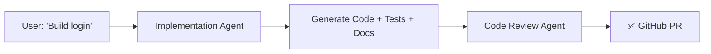

# 🤖 Awesome Prompts

> **Enterprise-Grade AI Agents + Reusable Skills for Autonomous Code Generation**

<div align="center">

[](https://github.com/sharmapuneet1510/awesome-prompts)
[](https://github.com/sharmapuneet1510/awesome-prompts/releases)
[](LICENSE)
[](https://github.com/sharmapuneet1510/awesome-prompts/commits/main)
[](docs/)

**Compatible with:** Claude Code • GitHub Copilot • Cursor • Windsurf • VS Code • Gemini CLI • Continue.dev • OpenAI • Aider

</div>

---

## 🌟 What's New in v3.1 (June 2026)

### ✨ Latest Features

- ✅ **Auto-Context Generation** — `orchestrator:build` now automatically generates project context (architecture.md, tech-stack.md, design.html) with dual commits, no manual steps (Issue #9)
- ✅ **Foundational Behavioral Principles** — All agents now operate under 4 core principles (Think Before Coding, Simplicity First, Surgical Changes, Goal-Driven Execution)
- ✅ **9 Specialist Agent Modes** — Invoke agents as Full-Stack Engineer, Code Auditor, Debugging Expert, Technical Lead, Performance Expert, etc.
- ✅ **28 Real-World Function Examples** — Complete examples for every agent function (see [FUNCTION_EXAMPLES.md](FUNCTION_EXAMPLES.md))
- ✅ **Professional Enhancement** — Removed external branding, pure professional guidance system
- ✅ **v3.1 Quality Functions** — Enhanced debug, perf, security functions with detailed workflows

---

## 🚀 Quick Overview

**Awesome Prompts v3.1** is a comprehensive, **production-ready system** of **5 role-based AI agents** and **24 reusable skills** that transform requirements into enterprise-grade code with:

| Feature | Details |
|---------|---------|
| 🎯 **31 Callable Functions** | `agent:function` syntax for targeted workflows (see [AGENTS_FUNCTIONS.md](AGENTS_FUNCTIONS.md)) |
| 🧪 **100% Test Coverage** | Unit, integration, and E2E tests with business validation |
| 📚 **Auto-Documentation** | JSDoc, docstrings, Javadoc + architecture guides + HTML sites |
| 🎯 **JIRA Integration** | Parse JIRA JSON/CSV → interactive HTML backlog reports |
| 🏗️ **Multi-Tech Support** | Java • Python • React • TypeScript • Node.js • SQL |
| 🤝 **MCP Servers** | JIRA, VCS, GitHub integrations via MCP |
| 🧠 **Auto-Context** | Generate architecture.md, tech-stack.md, context.json |
| ⚙️ **Full Orchestration** | Build complete systems (DB + API + UI + tests) + refactor monoliths |

---

## 💡 What's New in v3.0

### Architecture
- ✅ **Reduced from 13 → 5 agents** (role-based, no duplication)
- ✅ **31 callable functions** across all agents
- ✅ **No context loss** — implementer:full runs code + tests + docs in one pass
- ✅ **24 reusable skills** (from code generation to security audits)

### Repository Organization (June 2026)
- ✅ **Fully consolidated structure** — all definitions at root level
- ✅ **Removed src/ directory** — simplified path resolution
- ✅ **AP: vendor prefix** on all agents (multi-vendor distinction)
- ✅ **8 platform exports supported** (.github, .claude, .cursor, .windsurf, .gemini, .continue, .aider)
- ✅ **token_optimizer fully tested** (35/35 tests passing ✅)
- ✅ **Production-ready** and ready to scale

### Example v3.0 Functions:

```bash
# Orchestrator — Plan & orchestrate
orchestrator:plan requirements="Build user auth"    # Parse requirement, create tasks
orchestrator:build path=./design                    # Full-stack generation end-to-end

# Architect — Design systems
architect:design requirements="..."                 # Greenfield system topology
architect:refactor path=./monolith                  # Brownfield migration plan

# Implementer — Code + tests + docs (same context, no loss!)
implementer:build path=./api-spec                   # Generate code
implementer:test path=./src                        # Generate tests (95%+ coverage)
implementer:doc path=./src                         # Auto-generate documentation
implementer:full path=./design                     # BUILD + TEST + DOC in one pass

# Quality — Validate & optimize
quality:review pr=123                              # PR validation + scoring
quality:audit path=./src                           # Codebase audit
quality:security path=./src                        # OWASP security scan
quality:perf path=./src                            # Performance optimization
quality:diagnose problem="API slow"                # Conversational problem solver
quality:batch-review from=./reviews.json           # Multi-PR review with HTML report

# Business Analyst — Backlog management
ba:report file=jira-export.json                    # Parse JIRA → HTML backlog
ba:create path=./requirements.txt                  # Parse text → JIRA + BDD HTML cards
```

**See [AGENTS_FUNCTIONS.md](AGENTS_FUNCTIONS.md) for complete reference of all 31 functions.**

---

## 🎯 Foundational Principles (v3.1)

**All agents operate under 4 core behavioral principles** derived from Andrej Karpathy's observations on LLM coding pitfalls:

### 1. Think Before Coding
**State assumptions, surface tradeoffs, present options before committing.**

- Ask clarifying questions upfront (PHASE 0 in orchestrator:plan)
- Present multiple interpretations for ambiguous requirements
- Push back with simpler approaches
- Stop and ask when confused

### 2. Simplicity First
**Minimum code solving the problem. No overengineering or speculation.**

- No features beyond what was asked
- No abstractions for single-use code
- If 200 lines could be 50, rewrite to 50

### 3. Surgical Changes
**Touch only what you must. Clean up only your own mess.**

- Pre-implementation checklist: "List files you must modify"
- Post-implementation verification: "Every changed line traces to requirement"
- Don't improve adjacent code, only your own

### 4. Goal-Driven Execution
**Define success criteria upfront. Loop until verified.**

- Transform tasks into verifiable goals
- Test-first approach
- Verification loops built into all workflows

**See [CLAUDE.md](CLAUDE.md) and `instructions/master_instruction_set.md` for details.**

---

## 🎭 9 Specialist Agent Modes (v3.1)

Invoke agents as specialized roles suited to your task:

| Mode | Agent | Command | Use When |
|------|-------|---------|----------|
| **Full-Stack Engineer** | orchestrator:build | Build complete systems from scratch |
| **Code Auditor** | quality:audit | Analyze existing codebases for tech debt |
| **Debugging Expert** | quality:debug | Fix production bugs with RCA |
| **Technical Lead** | orchestrator:review/tradeoff/risk | Make architectural decisions |
| **Performance Expert** | quality:perf | Optimize slow applications |
| **Systems Architect** | architect:design | Design new system topology |
| **Frontend Expert** | architect:frontend | Build UI component systems |
| **Security Auditor** | quality:security | Find vulnerabilities (OWASP) |
| **DevOps Engineer** | implementer:pipeline/docker/iac | Setup CI/CD + infrastructure |

**See [SPECIALIST_AGENT_MODES.md](SPECIALIST_AGENT_MODES.md) for commands and examples.**

---

## 📖 Comprehensive Function Examples (v3.1)

**[FUNCTION_EXAMPLES.md](FUNCTION_EXAMPLES.md)** contains real-world examples for all 28 functions:

- **Orchestrator** (7 functions) — plan, build, context, review, tradeoff, risk, pr
- **Architect** (6 functions) — design, refactor, frontend, schema, api, a11y  
- **Implementer** (7 functions) — build, test, doc, pipeline, docker, iac, full
- **Quality** (8 functions) — review, audit, security, perf, debug, report, batch-review, diagnose
- **Business Analyst** (2 functions) — report, parse

Each example shows:
✓ Real-world scenario (e.g., MVP, chat system, monolith → microservices)
✓ Expected outputs (code, configs, diagrams)
✓ Parameters explained
✓ When to use

---

## 📂 Repository Structure (v3.1 — Fully Consolidated)

```
awesome-prompts/                       Reorganized June 2026 for clarity & scalability
│
├── 📋 agents/                         ← 5 role-based agents (AP: vendor prefix) + modules/functions
│   ├── orchestrator_agent.md          ← Strategy: plan, build, review, tradeoff, risk, context, pr
│   ├── architect_agent.md             ← Design: design, refactor, frontend, schema, api, a11y
│   ├── implementer_agent.md           ← Build: build, test, doc, pipeline, docker, iac, full
│   ├── quality_agent.md               ← QA: review, audit, security, perf, debug, batch-review, diagnose
│   ├── business_analyst_agent.md      ← Backlog: report, parse, create
│   ├── orchestrator/                  ← Orchestrator modules & functions
│   │   ├── modules/                   ← design_solver, expert_panel_generator, ideation_engine
│   │   └── functions/                 ← ideate, solve
│   └── README.md                      ← Agent dispatch syntax + 31 callable functions
│
├── 💡 skills/                         ← 24 reusable implementation modules
│   ├── code_documentation_skill.md    ← JSDoc/docstrings/Javadoc
│   ├── database_skill.md              ← SQL schema + migrations
│   ├── backend_skill.md               ← REST API generation
│   ├── frontend_skill.md              ← React components
│   ├── test_skill.md                  ← Test generation
│   ├── code_review_skill.md           ← 6-phase review + scoring
│   ├── multi_review_html_skill.md     ← Batch PR review with HTML
│   ├── jira_html_report_skill.md      ← Parse JIRA → HTML backlog
│   ├── ba_create_skill.md             ← Text requirements → JIRA + BDD HTML
│   ├── java_advanced_skill.md         ← Java 17/21 + Spring Boot
│   ├── python_advanced_skill.md       ← Python 3.11+ patterns
│   ├── react_advanced_skill.md        ← React 18+ + TypeScript
│   ├── context_builder_skill.md       ← Architecture analysis
│   ├── error_handling_skill.md        ← Exception patterns
│   ├── oop_skill.md                   ← OOP pillars + SOLID
│   ├── apache_camel_skill.md          ← Apache Camel integration
│   ├── apache_pulsar_skill.md         ← Apache Pulsar messaging
│   ├── opentelemetry_skill.md         ← Observability + tracing
│   ├── logger_skill.md                ← SLF4J + Logback
│   ├── lombok_skill.md                ← Lombok annotations
│   ├── code_health_skill.md           ← Code quality patterns
│   ├── code_formatting_skill.md       ← Style standards
│   ├── mssql_advanced_skill.md        ← T-SQL patterns
│   ├── spring_advanced_skill.md       ← Spring Framework
│   └── README.md                      ← Skills reference guide
│
├── 📖 instructions/                   ← Universal rules & intake templates
│   ├── master_instruction_set.md      ← Non-negotiable rules for all agents
│   ├── java_project_intake.md         ← Java/Spring Boot Q&A (33 questions)
│   ├── python_project_intake.md       ← Python Q&A with OOP patterns
│   └── technical_documentation_intake.md  ← Documentation template
│
├── 🔒 hooks/                          ← Git hooks & security guardrails
│   ├── promptshield-check.sh          ← Block injection attempts (user-prompt-submit)
│   ├── code-format-check.sh           ← Validate formatting (pre-commit)
│   ├── test-runner-pre-commit.py      ← Run tests before commit (pre-commit)
│   └── README.md                      ← Hook configuration guide
│
├── 🛠️ tools/                          ← UTILITIES & FRAMEWORKS
│   │
│   ├── exporter.py                    ← Export agents/skills to 9 platforms
│   ├── interactive_exporter.py        ← Interactive platform selector
│   ├── test_exporter.py               ← Test exporter pipeline
│   │
│   ├── instructions-framework/        ← Instruction parsing & middleware
│   │   ├── cli.py                     ← Command-line interface
│   │   ├── parser.py                  ← YAML instruction parser
│   │   ├── loader.py                  ← Load + merge instructions
│   │   ├── pipeline.py                ← Execution pipeline
│   │   ├── analyzers/                 ← Language detection (Java, Python, TS, etc)
│   │   ├── exporters/                 ← Platform exporters (Claude, Copilot, Cursor, etc)
│   │   ├── middleware/                ← Conflict detection, dependency resolution
│   │   └── README.md
│   │
│   ├── token_optimizer/               ← Query analyzer library (35 tests ✅)
│   │   ├── analyzer.py                ← Main QueryAnalyzer orchestrator
│   │   ├── models.py                  ← Dataclasses, enums, type-safe output
│   │   ├── config.py                  ← Configurable thresholds
│   │   ├── scoring.py                 ← Multi-dimensional scoring
│   │   ├── detector.py                ← Web search, token, external data detection
│   │   ├── setup.py (NEW)             ← Package setup
│   │   ├── pyproject.toml (NEW)       ← Project metadata
│   │   └── README.md                  ← Full documentation + examples
│   │
│   ├── feedback/                      ← Feedback analysis & tracking
│   │   ├── feedback_analyzer.py       ← Pattern analysis + insights
│   │   ├── feedback_processor.py      ← Process feedback YAML
│   │   └── README.md
│   │
│   ├── examples/                      ← Sample outputs & configs
│   │   ├── sample-batch-review.json
│   │   └── sample-code-review.md
│   │
│   ├── code_review_generator.py       ← Generate code review reports
│   ├── code_review_reporter.py        ← Format code review comments
│   ├── context_builder.py             ← Generate architecture documentation
│   ├── requirement_parser.py           ← Parse requirements from multiple sources
│   ├── config_generator.py             ← Generate project configurations
│   └── README.md                       ← Tools reference guide
│
├── 📚 docs/                           ← DOCUMENTATION
│   │
│   ├── README.md                      ← Documentation overview
│   ├── SETUP_GUIDE.md                 ← Installation & setup
│   ├── USAGE_GUIDE.md                 ← How to use agents & skills
│   ├── API_REFERENCE.md               ← Function reference
│   │
│   ├── architecture/                  ← System design documents
│   │   ├── agent-architecture.md
│   │   ├── skill-architecture.md
│   │   └── system-design.md
│   │
│   ├── guides/                        ← How-to guides
│   │   ├── adding-agents.md
│   │   ├── adding-skills.md
│   │   ├── exporting-to-platforms.md
│   │   └── feedback-and-guardrails.md
│   │
│   └── superpowers/                   ← Specs & implementation plans (COMMITTED)
│       ├── specs/                     ← Design specifications
│       └── plans/                     ← Implementation plans
│
├── 🧪 tests/                          ← TEST SUITE
│   │
│   ├── conftest.py (NEW)              ← Pytest configuration + PYTHONPATH setup
│   ├── test_token_optimizer.py        ← 35 tests, 100% PASS ✅
│   ├── fixtures/                      ← Test data fixtures
│   ├── test_agents/                   ← Agent-specific tests
│   ├── test_integration/              ← Integration tests
│   ├── test_services/                 ← Service tests
│   └── test_tools/                    ← Tool tests
│
├── 📦 examples/                       ← SAMPLE OUTPUTS & CONFIGS
│   ├── sample-batch-review.json
│   ├── sample-reviews/
│   └── sample-configs/
│
├── 🔐 .deprecated/                    ← ARCHIVED OLD CODE
│   └── old-prompts/                   ← Original prompts/ folder (for reference)
│
├── 🤝 .claude/                        ← Claude Code exports (TRACKED & COMMITTED)
│   ├── agents/
│   ├── skills/
│   └── hooks/
│
├── 📝 Core Files
│   ├── README.md (you are here!)
│   ├── CLAUDE.md                      ← Project instructions for Claude Code
│   ├── AGENTS_FUNCTIONS.md            ← Complete function reference (31 functions)
│   ├── .gitignore                     ← Git ignore rules (8 organized sections)
│   └── LICENSE
```

**Key Improvements:**
- ✅ **Fully consolidated** — agents, skills, instructions, hooks all at root level
- ✅ **No src/ complexity** — simplified path resolution for exporter
- ✅ **Scalable structure** — Ready for 100+ agents & skills
- ✅ **Platform exports managed** — .claude/ committed (others in .gitignore)
- ✅ **Generated output isolated** — graphify-out/, reviews/, .context/ in .gitignore
- ✅ **8 Platform support** — .github (Copilot), .claude (Claude), .cursor, .windsurf, .gemini, .continue, .aider, tools/output/openai

---

## 🎬 Getting Started

### Installation

```bash
# Clone the repository
git clone https://github.com/sharmapuneet1510/awesome-prompts.git
cd awesome-prompts

# No dependencies required!
# (Agents run via Claude Code, Copilot, or compatible platforms)
```

### Quick Start (5 Minutes)

<details open>
<summary><b>✨ Example 1: Build a User Registration Feature</b></summary>

**Step 1: Copy the Implementer Agent**
```
File: agents/implementer_agent.md
Function: implementer:full path=./design
```

**Step 2: Provide Your Requirement**
```
"Build user registration with email validation and password hashing"
```

**Step 3: Agent Delivers (all in one pass!)**
- ✅ Code (src/auth/register.py)
- ✅ Tests (tests/test_register.py) — 100% coverage
- ✅ Docs (JSDoc/docstrings with examples)
- ✅ GitHub PR (ready for review)

**Expected Output:**
```python
# Generated: src/auth/register.py
def register_user(email: str, password: str) -> User:
    """
    Register a new user with email and password.
    
    Args:
        email: User email address (RFC 5322 format)
        password: Plain-text password (will be hashed with bcrypt)
    
    Returns:
        User object with id, email, created_at
    
    Raises:
        ValueError: If email format is invalid
        EmailAlreadyExists: If email is already registered
    
    Example:
        user = register_user("john@example.com", "secure_password")
        assert user.email == "john@example.com"
    """
    # Auto-implemented with comprehensive docstring + tests
```

**Time:** ~5 minutes end-to-end (code + tests + docs + PR created)

</details>

<details>
<summary><b>📊 Example 2: Generate Test Cases with JIRA Validation</b></summary>

**Input:** JIRA ticket AUTH-456 (User Login)

**Process:**
1. Fetch requirement from JIRA
2. Extract acceptance criteria
3. Generate unit + integration tests
4. Validate all criteria are tested
5. Run full test suite (100% coverage)

**Output:**
```bash
$ pytest tests/test_login.py -v

tests/test_login.py::test_login_with_valid_credentials PASSED
tests/test_login.py::test_login_with_invalid_email PASSED
tests/test_login.py::test_login_with_weak_password PASSED
tests/test_login.py::test_login_with_concurrent_attempts PASSED
tests/test_login.py::test_login_with_rate_limiting PASSED
...
================== 8 passed, 100% coverage ==================
```

**JIRA Validation:**
```
✅ AC1: User can log in with email/password
✅ AC2: Invalid credentials return 401
✅ AC3: Rate limiting after 5 failed attempts
✅ AC4: Password attempt limit enforced
```

</details>

<details>
<summary><b>🔍 Example 3: Code Review with Requirement Validation</b></summary>

**Input:** PR #456 (merge request) + JIRA ticket PROJ-123

**Review Process:**
1. ✅ **Requirement Validation** — Does PR implement all JIRA acceptance criteria?
2. ✅ **Code Quality** — Design patterns, SOLID principles, security
3. ✅ **Test Coverage** — Adequate tests? Error cases? Edge cases?
4. ✅ **Documentation** — APIs documented? Comments clear?
5. ✅ **Scoring** — Weighted grade (A-F)

**Generated Report:**

```
╔════════════════════════════════════╗
║     CODE REVIEW SCORECARD          ║
╠════════════════════════════════════╣
║ Requirement Met:   95% ████████░  ║
║ Code Quality:      85% ███████░░  ║
║ Test Coverage:     72% ██████░░░  ║
║ Documentation:     68% ██████░░░░ ║
╠════════════════════════════════════╣
║ Final Grade: B (83.5/100)          ║
║ Status: ⚠️ Changes Needed           ║
╚════════════════════════════════════╝

Critical Issues:
1. [Security] P0 — SQL injection in email lookup
2. [Testing] P1 — Missing error case tests

→ Full analysis: /reviews/review-PROJ-123.html
```

</details>

---

## 🤖 Core Agents (v4.2.0)

### **1. Implementation Agent** — Full-Lifecycle Feature Builder
| Aspect | Details |
|--------|---------|
| **Input** | Requirement (free text / JIRA / file) |
| **Process** | Parse → Detect tech → Plan → Generate code + tests + docs |
| **Output** | Source code + 100% test coverage + JSDoc/docstrings + GitHub PR |
| **Time** | ~5-10 minutes per feature |
| **Tech Stack** | Java, Python, React, TypeScript, Node.js, SQL |

**Use When:** Building new features, adding API endpoints, implementing business logic

### **2. Code Review Agent v3** — Requirement-Driven Validation [NEW]
| Aspect | Details |
|--------|---------|
| **Input** | PR/MR + JIRA requirement |
| **Process** | 6-phase analysis (requirement → code quality → testing → docs → scoring) |
| **Output** | Interactive HTML report + MR comment summary |
| **Scoring** | A-F grades with weighted metrics |
| **Features** | Requirements validation, SOLID enforcement, security review, performance analysis |

**Use When:** Reviewing PRs against requirements, ensuring code quality, validating acceptance criteria

**New v3.0 Capabilities:**
- Requirement Validation: Does PR implement all JIRA acceptance criteria?
- Weighted Scorecard: Requirement (40%) + Code Quality (30%) + Testing (20%) + Docs (10%)
- Interactive Reports: HTML with charts, heatmaps, and actionable suggestions
- MR Comments: Posts summaries directly to GitHub/GitLab

### **3. Test Case Generator** — 100% Coverage + Business Validation
| Aspect | Details |
|--------|---------|
| **Input** | Code + JIRA ticket |
| **Process** | Analyze code → Generate tests → Validate all ACs → Run & measure |
| **Output** | Unit + integration tests with 100% coverage + JIRA validation |
| **Standard** | Comprehensive test methods, AAA pattern (Arrange-Act-Assert) |

**Use When:** Need complete test coverage, validating business requirements in tests, generating E2E tests

### **4. Writer Agent** — Auto-Generate Documentation
| Aspect | Details |
|--------|---------|
| **Input** | Source code files |
| **Process** | Parse → Extract APIs → Generate JSDoc/docstrings/Javadoc |
| **Output** | 100% documented APIs with examples + README updates + changelog |
| **Format** | Language-specific (JSDoc, docstrings, Javadoc) |

**Use When:** Need API documentation, README generation, changelog creation, documentation maintenance

### **5. Autonomous Dev Agent** — Full-Stack Orchestrator
| Aspect | Details |
|--------|---------|
| **Input** | Project requirement (e.g., "Build e-commerce checkout") |
| **Process** | 14-step orchestration (plan → DB → API → UI → tests → docs → PR) |
| **Output** | Complete working system (DB + backend + frontend + tests) |
| **Scope** | End-to-end project generation |

**Use When:** Starting new projects, generating complete systems, building MVPs quickly

---

## 🛠️ Reusable Skills

Each skill is **tech-agnostic** and used by agents to implement features:

| Skill | Purpose | Languages | Agents Using |
|-------|---------|-----------|--------------|
| **code_documentation** | JSDoc/docstrings/Javadoc | JS/TS/Python/Java | All |
| **database** | Schema + migrations + queries | PostgreSQL/MySQL/MongoDB | Autonomous Dev |
| **backend** | REST API generation | FastAPI/Spring Boot/Node | Implementation |
| **frontend** | React component generation | React/TypeScript | Implementation |
| **test** | Unit/integration/E2E tests | JUnit5/pytest/Jest | Test Generator |
| **code_review** [NEW] | 6-phase review analysis | Language-agnostic | Code Review Agent |
| **apache_camel** | Integration framework patterns | Apache Camel | Advanced users |

**Note on Structure:**
- Agents & skills are Markdown definitions (for Claude, Copilot, etc.)
- Python tools in `tools/` include implementations
- token_optimizer (35 tests ✅) is a production-ready library for query analysis
- Export to platforms: `python tools/exporter.py`

---

## 📋 Workflow Examples

### Workflow 1: Feature Implementation (5 Steps)



**Step-by-Step:**
1. **Requirement Input** — "Add JWT-based authentication"
2. **Tech Detection** — Scans project, detects Python/FastAPI
3. **Code Generation** — Generates auth routes, models, middleware
4. **Test Generation** — 100% coverage tests (happy path + errors)
5. **Documentation** — JSDoc/docstrings with examples
6. **GitHub PR** — Creates PR with auto-written description
7. **Code Review** — Validates implementation against requirement

**Time:** ~8 minutes

---

### Workflow 2: Test Generation with JIRA Validation


**Example JIRA Ticket:**
```
KEY: AUTH-456
Title: User Login with Rate Limiting

Acceptance Criteria:
1. User can log in with email/password
2. Invalid credentials return 401 Unauthorized
3. After 5 failed attempts, account locks for 15 minutes
4. Concurrent login attempts are prevented
```

**Generated Tests:**
```bash
test_login_valid_credentials() ✓
test_login_invalid_email() ✓
test_login_invalid_password() ✓
test_login_rate_limiting() ✓
test_login_concurrent_attempts() ✓
test_login_account_lockout() ✓
test_login_recovery_after_lockout() ✓
test_login_concurrent_recovery_attempts() ✓
```

**Coverage Report:**
```
Coverage: 100% (23 / 23 statements)
JIRA Validation: ✅ All 4 ACs covered
```

---

### Workflow 3: Code Review with Requirement Validation


**Example Review:**

| Phase | Score | Status |
|-------|-------|--------|
| Requirement Met | 87% | ⚠️ AC4 (async email) partially implemented |
| Code Quality | 83% | ⚠️ One SRP violation in UserService |
| Test Coverage | 70% | ❌ Missing error case tests |
| Documentation | 65% | ❌ Missing docstrings (40% of methods) |
| **Final Grade** | **B (80.2)** | **⚠️ Changes Needed** |

**Critical Issues Found:**
1. [Security] P0 — SQL injection in email validation
2. [Testing] P1 — Missing error case coverage
3. [Documentation] P2 — 40% of methods undocumented

---

## 🔗 Integration Points

### MCP Servers (Model Context Protocol)

Awesome Prompts integrates with these MCP servers for external data:

| Server | Purpose | Used By | Example |
|--------|---------|---------|---------|
| **JIRA MCP** | Fetch requirements & acceptance criteria | Test Generator, Code Review | `mcp.fetch_jira("PROJ-123")` |
| **GitHub MCP** | Create PRs, post comments, manage issues | All agents | `mcp.create_pr(title, body)` |
| **GitLab MCP** | GitLab integration | All agents | `mcp.create_mr(...)` |
| **Bitbucket MCP** | Bitbucket integration | All agents | `mcp.create_pr(...)` |

### Platform Support

```
┌─────────────────────────────────────────────────┐
│         Compatible Platforms                    │
├──────────────────┬──────────────────────────────┤
│ IDE Integration  │ Claude Code, Copilot, Cursor │
│ Code Editors    │ VS Code, JetBrains, Windsurf│
│ CLI Tools       │ Copilot CLI, Gemini CLI     │
│ LLM Providers   │ Anthropic (Claude)          │
│ VCS             │ GitHub, GitLab, Bitbucket   │
│ Project Mgmt    │ JIRA, Linear, Asana         │
└──────────────────┴──────────────────────────────┘
```

---

## 🎯 Key Features

### 🧠 Intelligent Context Building

Automatically generates project documentation:

```bash
$ python tools/context_builder.py

Generated:
├── architecture.md        ← System design with diagrams
├── tech-stack.md          ← Technology reference table
├── context.json           ← Machine-readable metadata
└── design.html            ← Interactive visualization
```

### 📊 Requirement Validation

Code Review Agent v3 validates PRs against JIRA acceptance criteria:

```
PR: Add user registration
JIRA: PROJ-123

✅ AC1: User can enter email/password (implemented in register.py:45-78)
✅ AC2: Email validation (RFC 5322) (implemented in validate_email.py:89)
⚠️  AC3: Password hashing (bcrypt) (implemented, but sync not async)
❌ AC4: Confirmation email (not found in diff)

Gap: Email notification is synchronous (performance issue)
Suggestion: Use task queue for async email sending
```

### 🔄 Exporter Tool

Export agents & skills to 9 platforms:

```bash
python tools/exporter.py --target claude copilot cursor

Generated:
├── claude/
│   ├── implementation_agent.md
│   ├── code_review_agent.md
│   └── test_case_generator_agent.md
├── copilot/
│   └── [same files]
└── cursor/
    └── [same files]
```

---

## 🚀 Advanced Usage

### Creating a Custom Skill

```markdown
---
name: Custom API Skill
version: 1.0
description: Generate REST APIs with OpenAPI spec
---

# Custom API Skill

## Overview
Generate production-ready REST APIs...

## Process
1. Parse requirements
2. Generate OpenAPI spec
3. Implement endpoints
4. Generate tests
5. Create documentation
```

### Using Skills in Custom Workflows

```python
from skills.code_documentation_skill import DocumentationGenerator
from skills.backend_skill import APIGenerator

# Generate API
api_gen = APIGenerator()
code = api_gen.generate_fastapi_endpoints("users", methods=["GET", "POST", "PUT"])

# Generate documentation
doc_gen = DocumentationGenerator()
docs = doc_gen.generate_docstrings(code, format="docstring")

# Save
with open("src/users_api.py", "w") as f:
    f.write(code)
    f.write("\n")
    f.write(docs)
```

### Integration with JIRA

```bash
# Fetch requirement from JIRA
JIRA_TICKET="PROJ-123"

# Test Case Generator automatically:
# 1. Fetches ticket details
# 2. Extracts acceptance criteria
# 3. Generates tests
# 4. Validates all ACs are covered
# 5. Runs test suite
```

---

## 📖 Documentation

### Project Intake Forms

Use these structured Q&A forms to gather project context:

- **Java Project Intake** (`instructions/java_project_intake.md`)  
  33 questions covering Spring Boot, testing, deployment

- **Python Project Intake** (`instructions/python_project_intake.md`)  
  Questions for FastAPI, Django, async patterns, OOP design

### Master Instruction Set

**All agents follow:** `instructions/master_instruction_set.md`

Non-negotiable rules:
- ✅ Always check versions first (Step 0)
- ✅ Use meaningful test names (givenXxx_whenYyy_thenZzz)
- ✅ Follow AAA testing pattern (Arrange-Act-Assert)
- ✅ Keep methods ≤ 20 lines, classes ≤ 300 lines
- ✅ Document all public APIs with examples
- ✅ Implement all OOP pillars with examples
- ✅ Use parameterized queries (prevent SQL injection)
- ✅ No secrets in logs or code

---

## 🛠️ Tools Reference

### Exporter Tool

Export agents & skills to 9 platforms (Claude, Copilot, Cursor, etc.):

```bash
# Export all
python tools/exporter.py

# Export specific
python tools/exporter.py --target copilot claude --skills java,spring --agents developer

# List available
python tools/exporter.py --list

# Dry run (preview)
python tools/exporter.py --dry-run

# Clean up
python tools/exporter.py --clean
```

### Context Builder Tool

Generate architecture documentation automatically:

```bash
python tools/context_builder.py

# Outputs:
# ├── architecture.md (Mermaid diagrams + narrative)
# ├── tech-stack.md (technology reference table)
# ├── context.json (machine-readable metadata)
# └── design.html (interactive visualization)
```

### Code Review Report Generator [NEW v3.0]

Generate interactive HTML code review reports:

```python
from tools.code_review_generator import ReviewReportGenerator

gen = ReviewReportGenerator(output_dir="reviews")
path = gen.generate(review_data, "PROJ-123")
# Output: reviews/review-PROJ-123-20260525T143022.html
```

---

## 🌟 Recent Updates (v4.2.0)

### ✨ New in May 2026

- **Code Review Agent v3.0** — Requirement-driven code review with scoring
  - 6-phase analysis (requirement → quality → testing → docs → grading)
  - Interactive HTML reports with charts and heatmaps
  - MR comment summaries with action items
  - Weighted scorecard (A-F grades)

- **Code Review Skill v3.0** — Reusable 6-phase review logic
  - Requirement validation against JIRA acceptance criteria
  - Code quality checklist (6 categories + SOLID principles)
  - Test coverage analysis with scenario mapping
  - Documentation audit (docstrings, parameters, examples)

- **HTML Report Generator** — Beautiful, interactive reports
  - 8 sections: scorecard, requirements, issues, file breakdown, heatmap, suggestions
  - Self-contained (no external dependencies)
  - Mobile-responsive CSS/JavaScript

- **MR Comment Formatter** — Concise markdown summaries
  - Scorecard + critical issues + action items
  - Ready to post to GitHub/GitLab/Bitbucket
  - Status emojis for visual clarity

- **Technical Documentation Agent** — Auto-generate project docs
  - Architecture diagrams with Mermaid
  - Tech stack reference tables
  - Interactive HTML visualization
  - JSON metadata for tools

---

## 🤝 Contributing

### Adding a New Agent

1. **Create file:** `agents/my_agent.md`
2. **Follow template:**
   ```markdown
   ---
   name: My Agent
   version: 1.0
   description: What this agent does
   ---
   
   # Agent Name
   
   ## Identity
   [Role, mission, motto]
   
   ## Workflow
   [Input → Processing → Output]
   
   ## Example
   [Real-world example]
   ```
3. **Export:** `python tools/exporter.py`
4. **Test:** Verify in Claude Code, Copilot, Cursor
5. **Submit PR:** Link to design doc + examples

### Adding a New Skill

1. **Create file:** `skills/my_skill.md`
2. **Define:** Purpose, process, output format
3. **Document:** Examples, usage patterns
4. **Test:** Run with an agent
5. **Submit PR**

### Reporting Issues

- **Bugs:** [GitHub Issues](https://github.com/sharmapuneet1510/awesome-prompts/issues)
- **Feature Requests:** [Discussions](https://github.com/sharmapuneet1510/awesome-prompts/discussions)
- **Security:** Security@example.com (responsible disclosure)

---

## 🗺️ Roadmap

### Q3 2026
- [ ] GitHub Actions integration for auto-testing
- [ ] Custom weight configuration for scorecard grading
- [ ] Inline PR comments (per-file issue reporting)
- [ ] Trend tracking (grade history per repo)

### Q4 2026
- [ ] AI-powered auto-fix suggestions
- [ ] CI/CD pipeline generation
- [ ] Database migration advisor
- [ ] Performance profiling agent

### 2027+
- [ ] Multi-language support (30+ languages)
- [ ] GraphQL API generation
- [ ] Microservices architecture advisor
- [ ] Cloud deployment orchestrator (AWS/GCP/Azure)

---

## 📚 Learn More

| Resource | Link |
|----------|------|
| **Agent Directory** | [agents/README.md](agents/README.md) |
| **Autonomous Dev Guide** | [AUTONOMOUS_DEVELOPER_README.md](AUTONOMOUS_DEVELOPER_README.md) |
| **Skill Catalog** | [skills/](skills/) |
| **Project Templates** | [docs/context/](docs/context/) |
| **Design Specs** | [docs/superpowers/specs/](docs/superpowers/specs/) |
| **Implementation Plans** | [docs/superpowers/plans/](docs/superpowers/plans/) |

---

## 📞 Support

- **Email:** sharmapuneet1510@gmail.com
- **GitHub Issues:** [Report a bug](https://github.com/sharmapuneet1510/awesome-prompts/issues)
- **Discussions:** [Ask questions](https://github.com/sharmapuneet1510/awesome-prompts/discussions)
- **Twitter:** [@puneet_sharma](https://twitter.com/puneet_sharma)

---

## 📄 License

MIT License — Feel free to use, modify, and distribute.

See [LICENSE](LICENSE) for details.

---

<div align="center">

### 🌟 If you find this useful, please star the repository!

[⭐ Star on GitHub](https://github.com/sharmapuneet1510/awesome-prompts) • [🐛 Report Issue](https://github.com/sharmapuneet1510/awesome-prompts/issues) • [💬 Discuss](https://github.com/sharmapuneet1510/awesome-prompts/discussions)

**Made with ❤️ by [Puneet Sharma](https://github.com/sharmapuneet1510)**

Last updated: June 8, 2026 | v3.1.0

</div>
