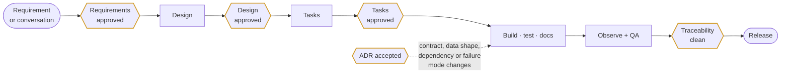

<div align="center">

# awesome-prompts

**Spec-driven engineering for AI coding assistants.**<br/>
Your assistant stops and asks before it builds the wrong thing — then leaves a record of why.

[](docs/02-reference/agents.md)
[](docs/02-reference/functions.md)
[](docs/02-reference/skills.md)
[](docs/01-workflows/14-export-to-platforms.md)
[](LICENSE)

[**Get started**](#quick-start) · [Workflows](docs/01-workflows/) · [Concepts](docs/00-getting-started/concepts.md) · [Reference](docs/02-reference/) · [Examples](docs/04-examples/)

</div>

---

## Why

AI assistants are fast and confident — including when they are wrong. They guess a requirement, build on the guess, and write documentation that hardens the guess into fact.

This repository gives an assistant two things it lacks:

- **Gates** that make it stop and ask you before it proceeds.
- **Labels** that keep a guess from being mistaken for a decision.

It works with Claude, Copilot, Cursor, Windsurf, Gemini, Continue, OpenAI, and Aider.

## How it works


```mermaid
flowchart LR
    REQ(["Requirement<br/>or conversation"]) --> G1{{"Requirements<br/>approved"}}
    G1 --> DES["Design"] --> G2{{"Design<br/>approved"}}
    G2 --> TSK["Tasks"] --> G3{{"Tasks<br/>approved"}}
    G3 --> BLD["Build · test · docs"]
    ADR{{"ADR accepted"}} -.->|"contract, data shape,<br/>dependency or failure<br/>mode changes"| BLD
    BLD --> OBS["Observe + QA"] --> G5{{"Traceability<br/>clean"}} --> REL(["Release"])

    classDef gate stroke:#d29922,stroke-width:2px
    class G1,G2,G3,G5,ADR gate
```

<sub>Simplified. Every hexagon is a **refusal, not a warning** — the assistant stops until you approve. Six gates in all; the sixth guards the specification itself ([below](#the-idea)).</sub>

## Quick start

**1. Get it**

```bash
git clone https://github.com/sharmapuneet1510/awesome-prompts.git
cd awesome-prompts
```

**2. See what is available** — read-only

```bash
python3 tools/exporter.py --list
```

**3. Install it into your project** — pick your assistant

```bash
python3 tools/exporter.py --target claude --target-project ~/code/my-app
```

You should see each file reported as copied, ending in `✓ Files copied to: …/my-app`. For Claude that creates `.claude/skills/`, `.claude/agents/`, `.claude/hooks/` and `.claude/prompts/` in your project.

<sub>Targets: `claude` · `copilot` · `cursor` · `windsurf` · `gemini` · `continue` · `openai` · `aider` · `all`. Just exploring? Run `python3 tools/exporter.py` inside the clone instead. `--dry-run` previews that in-repo export; it has no effect together with `--target-project`.</sub>

**4. Ask your assistant** — invoke a function by name

```text
architect:analyse jira=PROJ-123        # how does this work today?
architect:adr jira=PROJ-123            # record the decision
implementer:full path=./specs/checkout # build it
quality:observe pr=123                 # does it match what we agreed?
```

Full setup: [docs/00-getting-started/](docs/00-getting-started/).

---

## What do you want to do?

| | | Go to |
|---|---|---|
| 🚀 | **Set it up** | [docs/00-getting-started/](docs/00-getting-started/) |
| 🧭 | **Do a task** — most of the time | [docs/01-workflows/](docs/01-workflows/) |
| 📖 | **Look something up** | [docs/02-reference/](docs/02-reference/) |
| 🧪 | **See a worked example** | [docs/04-examples/](docs/04-examples/) |
| 💡 | **Understand the design** | [docs/00-getting-started/concepts.md](docs/00-getting-started/concepts.md) |

<details open>
<summary><b>The 14 workflows</b> — each names its prerequisites, command chain, the gates you will hit, and the artifacts you end up with</summary>

<br/>

| Stage | Workflow | Use it when |
|---|---|---|
| **Build** | [01 Start a new project](docs/01-workflows/01-start-new-project.md) | Greenfield, nothing exists yet |
| | [02 Feature from a conversation](docs/01-workflows/02-feature-from-conversation.md) | A stakeholder described a problem |
| | [03 Feature from a requirement](docs/01-workflows/03-feature-from-requirement.md) | You have a ticket |
| | [10 Modernise a legacy system](docs/01-workflows/10-modernise-legacy-system.md) | Structural change to something running |
| **Understand** | [04 Understand a codebase](docs/01-workflows/04-understand-a-codebase.md) | You inherited something |
| | [05 Record a decision](docs/01-workflows/05-record-a-decision.md) | Writing an ADR |
| | [12 Manage a backlog](docs/01-workflows/12-manage-backlog.md) | Jira in, readable out |
| **Verify & operate** | [06 Review a pull request](docs/01-workflows/06-review-a-pull-request.md) | A PR is open |
| | [07 Fix a production incident](docs/01-workflows/07-fix-production-incident.md) | Something is broken now |
| | [08 Audit security](docs/01-workflows/08-audit-security.md) | Finding abuse paths |
| | [09 Optimise performance](docs/01-workflows/09-optimise-performance.md) | Making it faster |
| **Ship & adopt** | [11 Set up CI/CD](docs/01-workflows/11-set-up-cicd.md) | Getting it deployed |
| | [13 Ship a release](docs/01-workflows/13-ship-a-release.md) | Proving the chain holds |
| | [14 Export to platforms](docs/01-workflows/14-export-to-platforms.md) | Using this in Cursor, Copilot, elsewhere |

Plus the [SDLC playbook](docs/01-workflows/sdlc-playbook.md): 16 stages, every command mapped to its stage and gate.

</details>

---

## The idea

**What is true now** and **why it became true** are separate documents.

| Question | Document | Property |
|---|---|---|
| How does this work today? | **Current Technical Specification** | Regenerated from decisions. Only current truth |
| Why is it like this? | **ADR log** | Immutable. Includes the paths not taken |

The specification is a **projection** of accepted decisions, rebuilt from scratch each time — so it never carries a claim no decision supports. ADRs are never edited or deleted, even when superseded: a superseded decision was correct when it was made, and that record is what stops someone re-introducing the design it replaced.

Ordinary documentation fails exactly here: it accumulates until no reader can tell which sentences are still true.

### Labels

Every substantive claim carries one. **Only a DECISION changes the specification.**

| Label | Means |
|---|---|
| `FACT` | Observed, and cited to a file and line |
| `INFERENCE` | Reasoned from facts |
| `PROPOSAL` | Awaiting your approval |
| `DECISION` | You approved it |

```text
FACT: OrderService.submit() has no idempotency key (src/order/service.py:88).
INFERENCE: retries during the payment timeout window likely double-charge.
PROPOSAL: add an Idempotency-Key header, deduped in Redis.
DECISION: approved 2026-08-18 — see ADR-0012.
```

This stops a plausible guess becoming the foundation for three more.

<details>
<summary><b>The six gates</b> — all refusals, none warnings</summary>

<br/>

| Gate | Blocks | You release it by |
|---|---|---|
| Requirements approved | `architect:design` | Approving `requirements.md` |
| Design approved | Task generation | Approving `design.md` |
| Tasks approved | `implementer:build` | Approving `tasks.md` |
| ADR accepted | Decision-bearing code | Approving the ADR |
| Traceability clean | Build, release | Resolving High findings |
| Label discipline | Specification changes | Only `DECISION` qualifies |

Trivial work — one-line fixes, config tweaks, small doc edits — is exempt from the spec gates.

</details>

More: [docs/00-getting-started/concepts.md](docs/00-getting-started/concepts.md).

---

## What is in here

| | What it is | Where |
|---|---|---|
| **Agents** | Five roles that orchestrate and dispatch | [`agents/`](agents/) · [reference](docs/02-reference/agents.md) |
| **Functions** | Callable as `agent:function` | [reference](docs/02-reference/functions.md) |
| **Skills** | Reusable implementation knowledge — adding a language means adding a skill, not an agent | [`skills/`](skills/) · [reference](docs/02-reference/skills.md) |
| **Prompts** | 18 templates in 12 categories | [`prompts/`](prompts/) |
| **Rules** | RULES 0–12 plus 4 behavioural principles | [`instructions/`](instructions/) · [reference](docs/02-reference/rules.md) |
| **Tools** | 22 Python utilities, including the exporter | [`tools/`](tools/) · [reference](docs/02-reference/tools.md) |

### The five agents

| Agent | Owns |
|---|---|
| **Orchestrator** | Planning, orchestration, trade-offs, risk, shipping |
| **Architect** | Design, technical analysis, decision records, the specification |
| **Implementer** | Code, tests, docs, CI/CD, infrastructure |
| **Quality** | Conformance, review, security, performance, debugging, QA suites |
| **Business Analyst** | Discovery, requirements, backlog, traceability |

<details>
<summary><b>Repository layout</b></summary>

<br/>

```text
├── README.md · CHANGELOG.md · CLAUDE.md · CREDITS.md
├── agents/          agent definitions + function files
├── skills/          reusable skills
├── prompts/         prompt templates by category
├── instructions/    master_instruction_set.md — RULES 0–12
├── tools/           Python utilities, incl. the 8-platform exporter
├── hooks/           automation hooks
├── token_optimizer/ query analysis library
├── parser/          Java field-derivation analysis
└── docs/
    ├── 00-getting-started/
    ├── 01-workflows/      ← 14 use cases
    ├── 02-reference/      ← agents, functions, skills, tools, rules, artifacts
    ├── 03-guides/
    ├── 04-examples/
    ├── 99-archive/
    └── superpowers/       this repo's own design records
```

</details>

<details>
<summary><b>History</b></summary>

<br/>

[CHANGELOG.md](CHANGELOG.md) — v1.0.0 (December 2025) through today, reconstructed from 280 commits.

The shape of it: a prompt collection became a skill library (v1.0.0), gained a multi-platform exporter (v2.0.0) and an autonomous developer system (v3.0.0), grew to thirteen agents (v3.5.0), consolidated back to five (v4.0.0), added the spec-driven gate (v4.2.0), then decision records and traceability (v5.0.0).

</details>

---

## Contributing

New skill? Read [`skills/agent_skill_design_skill.md`](skills/agent_skill_design_skill.md) first, then register it in [`skills/README.md`](skills/README.md).

Substantive changes to agent, skill, or instruction files are feature work under RULE 11 — they need the requirements → design → tasks chain. Only trivial edits are exempt.

## Credits

Prompt templates and several skills draw on [ai-boost/awesome-prompts](https://github.com/ai-boost/awesome-prompts). The four behavioural principles follow Andrej Karpathy's observations on LLM coding pitfalls. See [CREDITS.md](CREDITS.md).

## License

[MIT](LICENSE) © 2025–2026 Puneet Sharma.
